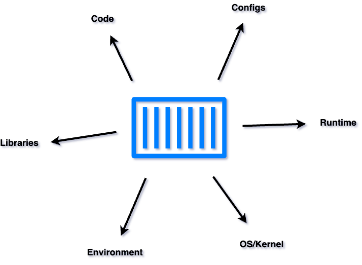
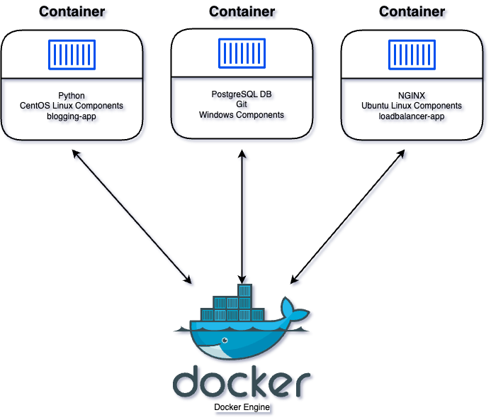
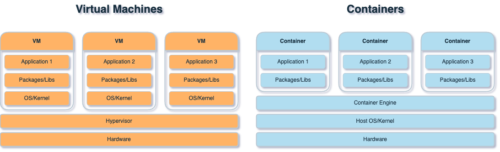
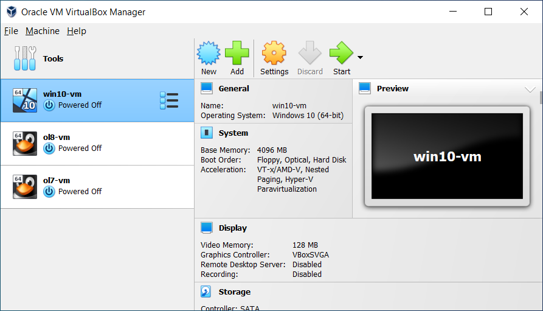
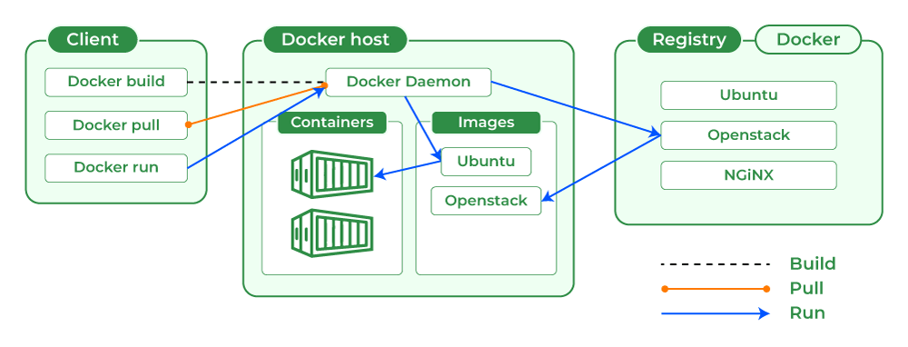
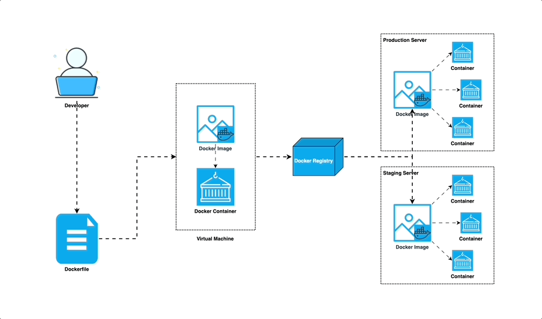
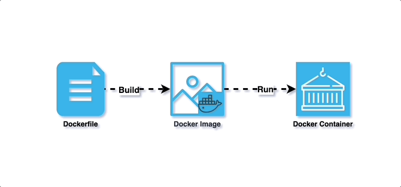

# Docker Workshop Session Notes

1. **Introduction to Containers**
    - What is Docker? and Containerization?
    - Containerization Concept
    - Difference(VM vs Containers)
    - Advantages and Disadvantages
2. **Installation**
3. **Docker Architecture**
4. **Docker Workflow**
5. **Docker Commands**
6. **Dockerfile**
    - Dockerfile Instructions
    - Docker Image
7. **Hands-On Examples(Creating and Containerizing)**
    - Challanges, 
8. **Docker Compose Concept**
9. **Important Docker Commands**
9. **Docker Volumes**

## 1. Introduction
### What is Docker?

Docker is a **Containerization** platform for packaging, deploying, and running applications as **CONTAINERS**.



### What is containerization? 📦

**Containerization** is a lightweight form of virtualization that allows you to encapsulate an application and its dependencies into a self-contained unit called a "container." 
****

Docker applications run in **containers** that can be used on any system: a developer’s laptop, systems on premises, or in the cloud. (it runs the same)



Containers share the host operating system's kernel, but they have their own isolated file system, processes, and networking.

### Difference between VMs & Containers





| Aspect | Containers | Virtual Machines |
| --- | --- | --- |
| **OS** | Shares host's Kernel | Has its own Kernel |
| **Resource Usage** | Lightweight, efficient | Heavier, more resource usage |
| **Startup Time** | Quick start | Slower start |
| **Isolation** | Process-level separation | Full OS isolation |
| **Portability** | Highly portable | Compatibility concerns |
| **Resource Overhead** | Minimal overhead | Higher overhead |
| **Isolation Level** | Lighter isolation | Stronger isolation |


Learning Resource: 

[Containers vs VM - Difference Between Deployment Technologies - AWS](https://aws.amazon.com/compare/the-difference-between-containers-and-virtual-machines/)

<aside>
💡 It’s important to note that Docker containers don’t run in their own virtual machines, but share a Linux kernel. Compared to virtual machines, containers use less memory and less CPU.

However, a Linux runtime is required for Docker. Implementations on non-Linux platforms such as macOS and Windows 10 use a single Linux virtual machine. The containers share this system.

</aside>

### Advantages of Containerization
- Increased **Portability**
- Easier **Scalability**
- Easy and Fast **Deployments**
- Better **Productivity**
- Improved **Security**
- Consistent test environment for development and QA.
- Cross-platform packages called images.
- Isolation and encapsulation of application dependencies.
- Ability to scale efficiently, easily, and in real time.
- Enhances efficiency via easy reuse of images.

### Disadvantage
- Compatibility issue: *Windows container won’t run on Linux machines and vice-versa*

#### Other disadvantages(*Discovered by me*)😎
- Counter-productivity or efficiency-draining issue: *Hard to turn a 5-minute task to a 5-hour task*
- Troubleshooting issue: *It will be hard, to be able to find tons of dependency issues*


## 2. Installation 

[Get Docker](https://docs.docker.com/get-docker/)

## 3. Docker Architecture



Docker uses a client-server architecture to manage and run containers:

1. **Docker Client:**
    - The Docker client is the command-line interface (CLI) or graphical user interface (GUI) that users interact with to build, manage, and control Docker containers.
    - It sends commands to the Docker daemon to perform various tasks.
2. **Docker Daemon:**
    - The Docker daemon is a background process that manages Docker containers on a host system.
    - It listens for Docker API requests and takes care of building, running, and managing containers.
3. **Docker Registry:**
    - Docker images can be stored and shared through Docker registries.
    - A Docker registry is a repository for Docker images, and it can be public (like Docker Hub) or private.
4. **Docker Hub:**
    - Docker Hub is a cloud-based registry service provided by Docker, where users can find, share, and store Docker images.
    - It serves as a central repository for Docker images.
    

Here's a high-level overview of the interaction between these components:

- The Docker client communicates with the Docker daemon, sending commands and receiving information about containers, images, etc.
- Docker images are fetched or built from the Docker registry.
- Containers are created, started, stopped, and managed by the Docker daemon.

### 4. Docker Workflow



#### More on Docker? - **Ufffffffff!!!!!**


---

### 5. Docker Commands

1. **Image Commands:**
    - **docker pull**: Pull an image from a registry.
        - Example: `docker pull nginx:latest`
    - **docker build**: Build an image from a Dockerfile.
        - Example: `docker build -t myapp:1.0 .`
    - **docker images**: List all images on the local machine.
        - Example: `docker images`
    - **docker rmi**: Remove an image.
        - Example: `docker rmi image_id`
2. **Container Commands:**
    - **docker run**: Run a container from an image.
        - Example: `docker run -d -p 8080:80 myapp:1.0`
    - **docker ps**: List running containers.
        - Example: `docker ps`
    - **docker stop**: Stop a running container.
        - Example: `docker stop container_id`
    - **docker rm**: Remove a stopped container.
        - Example: `docker rm container_id`
    - **docker exec**: Execute a command in a running container.
        - Example: `docker exec -it container_id bash`
    - **docker logs**: View logs of a container.
        - Example: `docker logs container_id`
3. **Volume Commands:**
    - **docker volume ls**: List all volumes.
        - Example: `docker volume ls`
    - **docker volume create**: Create a new volume.
        - Example: `docker volume create myvolume`
4. **Network Commands:**
    - **docker network ls**: List all networks.
        - Example: `docker network ls`
    - **docker network create**: Create a new network.
        - Example: `docker network create mynetwork`
5. **Docker Compose Commands:**
    - **docker-compose up**: Start services defined in a `docker-compose.yml` file.
        - Example: `docker-compose up -d`
    - **docker-compose down**: Stop and remove services defined in a `docker-compose.yml` file.
        - Example: `docker-compose down`
    - **docker-compose ps**: List services and their status.
        - Example: `docker-compose ps`
6. **Swarm Commands (for orchestration):**
    - **docker swarm init**: Initialize a Docker swarm.
        - Example: `docker swarm init`
    - **docker service**: Manage Docker services in a swarm.
        - Example: `docker service ls`
7. **System Information:**
    - **docker version**: Display Docker version information.
        - Example: `docker version`
    - **docker info**: Display system-wide information about Docker.
        - Example: `docker info`
8. **Image Commands:**
    - **Tag an Image**:
        - Example: `docker tag myapp:1.0 myregistry/myapp:1.0`
        - Explanation: Tags an image with a different name, providing a way to reference the same image under different names.
    - **Remove Unused Images**:
        - Example: `docker image prune`
        - Explanation: Removes all dangling (unused) images.
    - **Remove All Images**:
        - Example: `docker rmi $(docker images -q)`
        - Explanation: Removes all images on the local machine.
9. **Container Commands:**
    - **Remove Stopped Containers**:
        - Example: `docker container prune`
        - Explanation: Removes all stopped containers.
    - **Remove All Containers**:
        - Example: `docker rm -f $(docker ps -aq)`
        - Explanation: Removes all containers, including running ones.
10. **Volume Commands:**
    - **Remove Unused Volumes**:
        - Example: `docker volume prune`
        - Explanation: Removes all unused volumes.
11. **Network Commands:**
    - **Remove Unused Networks**:
        - Example: `docker network prune`
        - Explanation: Removes all unused networks.
12. **System Cleanup:**
    - **Remove All (Containers, Images, Volumes, Networks)**:
        - Example: `docker system prune -a`
        - Explanation: Removes all stopped containers, unused networks, dangling images, and unused volumes.

Remember to exercise caution when using commands that remove resources, as they can result in data loss. Always double-check the resources you are about to remove.

## 6. Dockerfile
### Dockerfile Instructions

[Dockerfile Instructions](https://docs.docker.com/reference/dockerfile/)

#### Docker Image

A Docker image is a read-only template containing a set of instructions for creating a container that can run on the Docker platform. Docker images are also the starting point for anyone using Docker for the first time.



#### Time for Hands-On? - **YEAHHHHH!!!!!**


## 7. Hands-On Practice

**Challenge 1**

*Run a container with the `nginx:1.14-alpine` image and name it `webapp`.*

```bash
docker run -p 4000:80 --name webapp -d nginx:1.14-alpine
```

**Challenge 2**

*Containerize Python application and push the image to Dockerhub.*

**Step 1** - Create Python/NodeJS app. (Clone from GitHub) =>[Python](https://github.com/sbmagar/luckydrawapp-python) OR [NodeJS](https://github.com/sbmagar/luckydrawapp-nodejs)

**Step 2** - Write Dockerfile for the app

**Step 3** - Create image for the app

**Step 4** - Run the container for the app 

**Step 5** - If it works push the image on Dockerhub (optional)

#### ENV variables

- **Purpose**: Environment variables in Docker are used to configure applications, control runtime behavior, and manage sensitive information.
- **Configuration**: They replace hardcoded values in configuration files, enabling flexibility across different environments.
- **Dynamic Behavior**: Environment variables can control feature toggles, logging levels, and runtime environments.
- **Secrets Management**: Sensitive data like passwords or API keys can be securely injected into containers using environment variables.
- **Setting Variables**:
    - Use `ENV` instruction in Dockerfile to set variables during image build.
    - Pass variables with `-e` or `--env` flag in `docker run` command.
    - Define them in `docker-compose.yml` under the `environment` key.
    - In Docker Swarm, set them with `docker service create/update` or in a Docker Compose file for Swarm.
- **Flexibility and Portability**: Environment variables make Dockerized applications easier to manage and deploy across multiple environments.

**Challenge 3**

*Run a container named `shrawan-app` using image `sbmagar/bloggingapp` and set the environment variable `APP_COLOR` to `green`. Make the application available on port `75666` on the host. The application listens on port `5000`.*

- Solution:
```
docker run -d \
--name shrawan-app \
-p 75666:5000 \
-e APP_COLOR=green \
sbmagar/bloggingapp
```


#### Commands & Arguments


<aside>
💡 Always remember that a container does not host an operating system; instead, it runs a process and will be terminated once the process is completed.

</aside>

```docker
# Use a base image
FROM alpine:latest

# Run a sleep command when the container starts
CMD ["sleep", "3600"]
```

**`CMD ["sleep", "3600"]`** ✅   
**`CMD ["sleep 3600"]`** ❌

it's recommended to use the first form (**`CMD ["sleep", "3600"]`**) to specify the command and its arguments as separate elements in a JSON array for clarity and to ensure proper execution.


ENTRYPOINT

**`ENTRYPOINT`** is a Dockerfile instruction that specifies the command to run when a container is started from the Docker image. Unlike **`CMD`**, which provides default arguments to the command defined by **`ENTRYPOINT`**, **`ENTRYPOINT`** sets the main command that will be executed when the container starts, regardless of any arguments provided at runtime.

```docker
FROM alpine:latest

# Set the sleep command as the entry point
ENTRYPOINT ["sleep"]

# Set a default sleep time of 3600 seconds (1 hour)
CMD ["3600"]
```

Explanation:

- This Dockerfile starts with a base image of Alpine Linux.
- The **`ENTRYPOINT`** instruction specifies that the **`sleep`** command will be the main command to run when the container starts.
- The **`CMD`** instruction sets a default argument for the **`sleep`** command, specifying the sleep time in seconds. In this case, the default sleep time is 3600 seconds (1 hour).

Override arguments

```docker
docker run my_image **1800**   # Sleeps for 1800 seconds (30 minutes)
```

Communication Between containers.

for multiple containers dependent on one another we can command line argument —link

When using the `--link` option in Docker:

- A secure tunnel is created between containers for communication.
- Environment variables are set in the destination container, providing details about the linked container.
- Docker updates the `/etc/hosts` file in the destination container to resolve the hostname of the linked container.
- Access to exposed ports in the linked container is provided.
- Docker implicitly creates a network bridge interface for secure communication between linked containers.

- Example:
    - **Run MySQL Container**: Start the MySQL container with a name `mysql-container`, exposing port 3306:
        
        ```bash
        docker run --name mysql-container -e MYSQL_ROOT_PASSWORD=password -d mysql:latest
        ```
        
    - **Create a .NET Core Application**: Assume you have a .NET Core application that needs to connect to the MySQL database. Build the .NET Core application and create a Docker image for it. Here's a simple Dockerfile assuming the application is published to a folder named `app`:
        
        ```
        FROM mcr.microsoft.com/dotnet/core/runtime:latest
        WORKDIR /app 
        COPY ./app .
        ENTRYPOINT ["dotnet", "sampleapp.dll"]
        ```
        
    - **Run .NET Core Application Container Linked to MySQL**: Now, run the .NET Core application container, linking it to the MySQL container:
        
        ```bash
        docker run --name dotnet-app --link mysql-container:mysql -d your-dotnet-image:latest
        ```
        
    
    In this example:
    
    - `--name mysql-container` assigns the name `mysql-container` to the MySQL container.
    - `-e MYSQL_ROOT_PASSWORD=password` sets the root password for MySQL.
    - `-name dotnet-app` assigns the name `dotnet-app` to the .NET Core application container.
    - `--link mysql-container:mysql` links the .NET Core application container to the MySQL container with an alias `mysql`.
    - `-d` runs both containers in detached mode.
    
    Inside the .NET Core application container, you can now access the MySQL database using the hostname `mysql` and the exposed port. Make sure your .NET Core application is configured to connect to MySQL using the correct hostname and port.
    

<aside>
💡 However, as of Docker version 1.9, the **`--link`** option is considered a legacy feature, and Docker recommends using user-defined networks instead for inter-container communication. User-defined networks provide better isolation, scalability, and ease of use compared to the legacy linking mechanism.

</aside>

So what then?

## 8. Docker Compose

A configuration file to run multiple containers in one command

--links

- 1  docker run --name redis redis:alpine ⚠️
- 2  docker run --name redis -d redis:alpine ⚠️
- 3  docker rm redis ⚠️
- 4  docker run --name redis -d redis:alpine ⚠️
- 5  docker run --name luckydrawapp --link redis:redis -p 5000:5000 luckydraw-app:latest ✅✅
- 6  docker rm luckydrawapp ⚠️
- 7  docker run --name luckydrawapp --link redis:redis -d -p 5000:5000 luckydraw-app:latest ✅✅

```
version: '3.8'
services:
  redis:
    image: redis:alpine
  luckydrawapp:
    image: luckydraw-app:latest
    ports:
      - 5000:5000
```

---

### 9. Docker Volumes:

Docker volumes are a way to persist data generated by and used by Docker containers. They provide a mechanism for sharing data between a host machine and Docker containers or between containers themselves.

#### Types of Volumes:

1. **Named Volumes:** Managed by Docker, easier to use and manage.
2. **Host Volumes:** Maps a directory from the host machine into the container.
3. **Anonymous Volumes:** Similar to named volumes but managed by Docker with a randomly generated name.

#### Commands:

1. **Create a named volume:**
    
    ```bash
    docker volume create my_volume
    ```
    
2. **Run a container with a named volume:**
    
    ```bash
    docker run -v my_volume:/path/in/container image_name
    ```
    
3. **List all volumes:**
    
    ```bash
    docker volume ls
    ```
    
4. **Inspect a volume:**
    
    ```bash
    docker volume inspect my_volume
    ```
    
5. **Remove a volume:**
    
    ```bash
    docker volume rm my_volume
    ```
    
6. **Mount a host directory as a volume:**
    
    ```bash
    docker run -v /host/path:/container/path image_name
    ```
    

#### Dockerfile Example:

```
# Define a volume
VOLUME /data

# Set working directory
WORKDIR /data

# Copy files into the container
COPY . /data
```

#### Docker Compose Example:

```yaml
version: '3.8'

services:
  app:
    image: my_app_image
    volumes:
      - my_volume:/app/data

volumes:
  my_volume:
    external: true
```

#### Lastly, points to remember:

- Volumes are useful for persisting data even if containers are removed.
- They can be shared between containers.
- Docker volumes are stored in a part of the host filesystem which is managed by Docker.

---

https://docs.docker.com/guides/

https://docs.docker.com/compose/

https://docs.docker.com/engine/reference/commandline/compose/